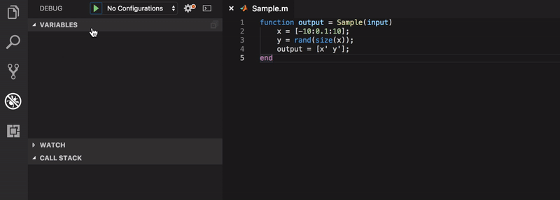

# VS Code Octave Debugger

This extension provides debugging support for code runnable on Octave (might include Matlab code).
This is done by interfacing with octave-cli via stdin/stdout. Do read the changelog to know what's new in this version.
Though this is not necessary to use the extension, I still recommend the following language extensions for [matlab](https://marketplace.visualstudio.com/items?itemName=Gimly81.matlab) and [octave](https://marketplace.visualstudio.com/items?itemName=toasty-technologies.octave).

**Octave Debugger**
This extension supports actions:
 * continue, step, step in, step out,
 * breakpoints, conditional breakpoints,
 * variable inspection, variable editing
 * stack navigation and visualization
 * expression evaluation, via console input, watch UI, or mouse hover

The following types are currently supported:
 * Scalar: [floats](https://octave.org/doc/v4.0.0/Single-Precision-Data-Types.html) and [ints](https://octave.org/doc/v4.0.0/Integer-Data-Types.html), the default type being double
 * [Matrix](https://octave.org/doc/v4.0.0/Matrices.html) of all basic types, includes ComplexMatrix/BoolMatrix
 * [DiagonalMatrix/ComplexDiagonalMatrix/PermutationMatrix](https://octave.org/doc/v4.2.1/Diagonal-and-Permutation-Matrices.html#Diagonal-and-Permutation-Matrices)
 * [SparseMatrix/SparseComplexMatrix](https://octave.org/doc/v4.0.3/Sparse-Matrices.html)
 * [Range](https://octave.org/doc/v4.0.0/Ranges.html)
 * [ScalarStruct/Struct](https://octave.org/doc/v4.0.0/Structures.html)
 * [InlineFunction](https://octave.org/doc/v4.0.0/Inline-Functions.html)
 * LazyIndex
 * SqString
 * UnknownType: represents unknown types as strings.

If a type isn't supported request it on the [project repository](https://github.com/paulo-fernando-silva/vscOctaveDebugger.git).

If you want to edit the value of a variable be it scalar, array, or structure, you can double click on it in the VARIABLES view, and type in the new value.
That expression will be evaluated and if successful the variable will be updated with the new value.
You can also submit any command you like through the debug console as if it you were typing directly into Octave.

More information about debugging with Octave can be found
[here](https://www.gnu.org/software/octave/doc/v4.0.0/Debugging.html).

## Using Octave Debugger

* Open a directory containing the project that you want to debug.
* Switch to the debug view and press the gear dropdown.
* Click on "debug configuration" and select "OctaveDebugger" from the configuration menu that comes up.
* You can set "program" parameter to whatever filename / function you want to debug, e.g.:
    "name": "My configuration",
    "program": "myFunctionOrScript"
    Program can be anything that can be evaluated. Can be a "path/to/file.m", or "functionName(value)".
* Set breakpoints as needed by clicking on the empty space left of the line numbers.
* Press the 'play' button to start debugging. If you have the default keybindings then F5 should also work.
If you don't set any breakpoints it'll just run Octave in the DEBUG CONSOLE as if you were running from the terminal.

Project homepage and source available
[here](https://github.com/paulo-fernando-silva/vscOctaveDebugger.git).
Please submit bugs there too.

## History :)

I started this project back in December 2017 or January 2018, not quite sure anymore, when I was going through the exercises from the [Andrew Ng's machine learning class](http://openclassroom.stanford.edu/MainFolder/CoursePage.php?course=MachineLearning).
Also check these playlists [Stanford Machine Learning](https://www.youtube.com/watch?v=UzxYlbK2c7E&list=PLA89DCFA6ADACE599), [Caltech Learning from Data](https://www.youtube.com/watch?v=VeKeFIepJBU&list=PLCA2C1469EA777F9A), [Deep Learning tutorial](http://ufldl.stanford.edu/tutorial/),and there's plenty more from MIT and others.

Since I was really into vscode but unfortunately there was no octave debugger at the time, and since I have a long commute to work, I decided to use that time to develop this adapter.
It kind of was an on and off development, but I would say that about 80% of it was done on the train while commuting to work. I really would like to thank Andrew and all the openclassroom and other similar projects (e.g. OpenCourseWare), and of course the people behind vscode. The best editor of its genre out there.

## High-Level Description of Inner Workings

A debug session follows these steps
 * Debug session begin or step
 * Request stack frames comes in
 * Request scopes for selected frame comes in (usually 0, the top frame, but can go up to n where n is the current stack frames depth).
 * Request variables for current open scopes comes in (scope reference is only fetched if > 0) If scope is different than 0, then we need to do a dbup or dbdown before fetching the variables.
 * Request child variables as needed (child variable ref > 0)

More information about vscode Debug Adapter Protocol can be found here [DAP](https://microsoft.github.io/debug-adapter-protocol/overview) and the [API](https://code.visualstudio.com/docs/extensionAPI/api-debugging), and information on publishing extensions can be found [here](https://code.visualstudio.com/docs/extensions/publish-extension#_publishers-and-personal-access-tokens).
Funny fact, I noticed too late that the name of the plugin is not only spelled wrong but also it doesn't follow the expected "no caps and words separated by hyphens" pattern. :p